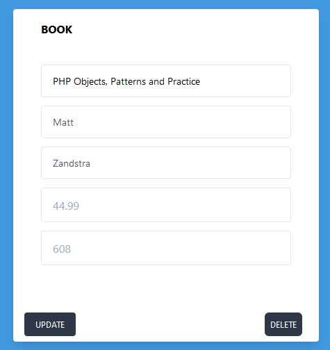

# Component 2 - Task

This is an extension of Component 1 and using Laravel as a Framework for working with your views and data.

Data is again being stored as a json file and some of the previous PHP files are being used to read and update this 
data on the server side. The <b>JsonUtility</b> class has some additional methods in for amending this data on the server.
In the previous task you wrote HTML directly through the HTML writer class. In this exercise you are to work with Views 
in Laravel, and use appropriate Routes to call methods in a <b>ProductController</b> class

You are required to:

<ul>
<li>embed these files into a Laravel Project - the structure already used will map into Laravel.</li>
<li>create a front end (views) that will allow a user to perform CRUD operations</li>
<li>products should be displayed with a reusable template (i.e. card)</li>
<li>follow good practice and naming conventions for defining your routes, and methods in the controller</li>
</ul>

A javascript file has been provided which includes axios calls for performing asynchronous web requests. 
If using this then make note of the id and class selector names being used. Axios is a package which is included with 
Laravel.

## Sample Screens

An expected layout and structure could take the following form

## CREATE + READ

[IMAGE](readme_images/read.jpg)

Full Product Listing will include a blank template card at the end with POST (add button)

### UPDATE + DELETE

[IMAGE](readme_images/read.jpg)

A 'Selected' product will show a modified template with PATCH (update button) and DELETE (delete button) options

